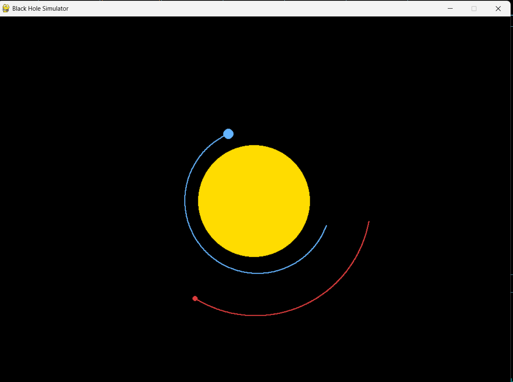
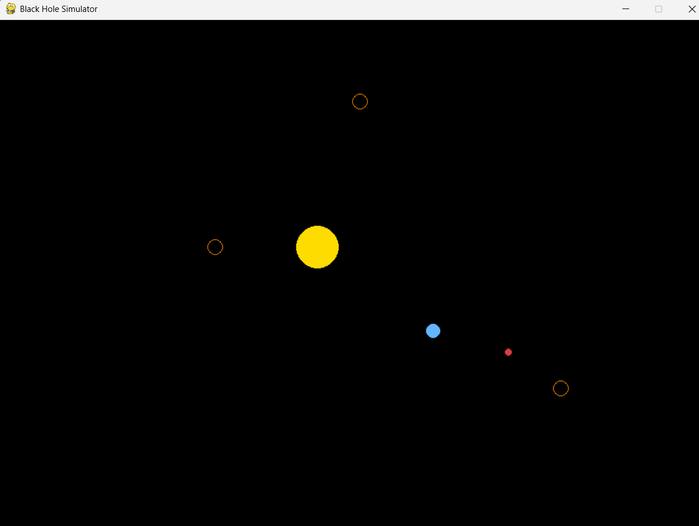

# Black Hole Simulator

A real-time N-body gravitational simulator built in Python.
Implements Newtonian gravity (F = Gm₁m₂/r²) with Euler integration.

## Physics
- Gravitational force computed between every pair of bodies each frame (F = Gm₁m₂/r²)
- Time step: 10,000 simulated seconds per frame

## Features (current)
- N-body simulation (Sun, Earth, Mars + spawnable black holes)
- Click anywhere to spawn a black hole with real gravitational mass
- Body absorption when within event horizon radius
- Scalable coordinate system (1 pixel = 1,000,000 km)

## Planned
- Gravitational lensing approximation
- Runge-Kutta integration for higher accuracy

## Stack
Python · Pygame · No external ML/data libraries

## Run
pip install pygame
python main.py

