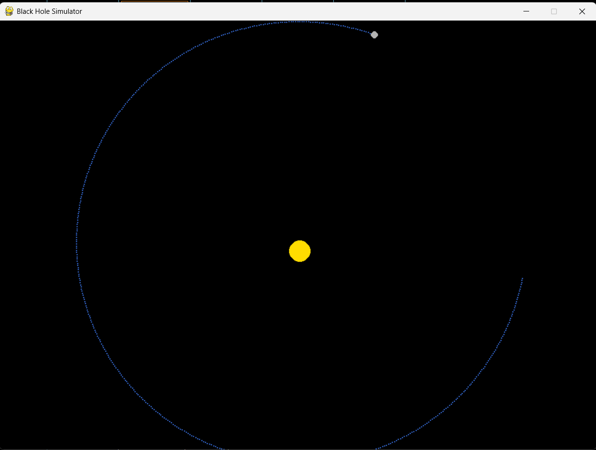

# Black Hole Simulator

A real-time N-body gravitational simulator built in Python.
Implements Newtonian gravity (F = Gm₁m₂/r²) with Euler integration.

## Physics
- Gravitational force computed between every pair of bodies each frame
- Schwarzschild radius visualised: R = 2GM/c²
- Time step: 1 simulated hour per frame

## Features (current)
- 2-body orbit simulation
- Scalable coordinate system (1 pixel = 1000 km)

## Planned
- N-body multi-object simulation
- Gravitational lensing approximation
- Interactive body placement

## Stack
Python · Pygame · No external ML/data libraries

## Run
pip install pygame
python main.py

